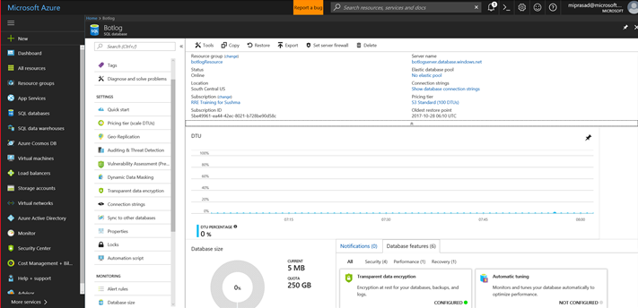
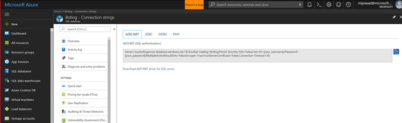
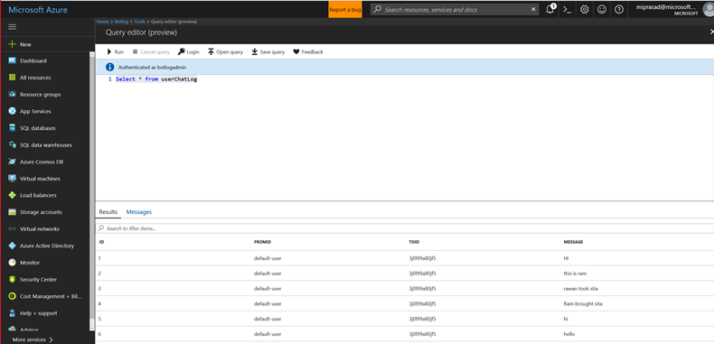

# SQL Logger

## 1.	Objectives

The aim of this lab is to log chat conversations to Azure SQL database. This lab is an extension of the previous File Logger lab where we used Global.asax events and LogAsync methods.

## 2.	Setup/Pre-requisites

2.1. Since we will be writing to a SQL database, either we can use a database that you may already have or create a new one. To create a new one, go to the azure portal and follow the [Create DB – Portal](https://docs.microsoft.com/en-us/azure/sql-database/sql-database-get-started-portal) steps to create a database called Botlog as shown below.



2.2. Select Show database connection strings from the Overview tab and make a note of the connection string as we will be using it later in the lab.



2.3. Change your firewall settings to capture your ip address. You may have already done this if you followed the steps from [Create DB – Portal](https://docs.microsoft.com/en-us/azure/sql-database/sql-database-get-started-portal)



2.4. Create a new table called userChatLog with the below create table statement (or schema):

```
CREATE TABLE userChatLog(id int IDENTITY(1, 1),fromId varchar(25),toId varchar(25),message varchar(max),PRIMARY KEY(id));
```
